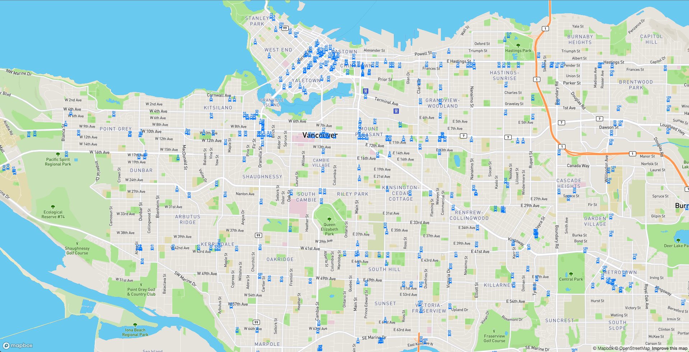

# Translink with Firebase

The purpose of this project is to produce a near-real-time location reporting of Translink buses mapped on a responsive webapp.

The following tools were used:
1. [Translink api](https://developer.translink.ca)
2. [react-map-gl](https://github.com/uber/react-map-gl)
3. [superagent](https://github.com/visionmedia/superagent)
4. [lodash](https://lodash.com/)
5. [redux](https://redux.js.org/)
6. [redux-thunk](https://github.com/gaearon/redux-thunk)
7. [firebase](https://firebase.google.com)

### What it looks like

<p align="center">
	
</p>

[Check it out here in production.](https://translink-79b18.firebaseapp.com/)

### Try it out

Clone or download the repository and run:
```ruby
npm install
```


### Caveats

If you request Translink's api directly from the browser, you will get CORS issues.

Here are some ways to bypass this:

For development purposes you can bypass this by installing the Allow-Control-Allow-Origin Chrome extension [Link](https://chrome.google.com/webstore/detail/allow-control-allow-origi/nlfbmbojpeacfghkpbjhddihlkkiljbi).

To resolve this for production, you can build and host your own server that host the data returned from Translink.
For this example project,  firebase cloud functions and database were used as a work around to resolve this issue.

Here are the steps to add firebase to your react project:

1. Install firebase in your project directory to be able to access db features.

```ruby
npm install firebase
```

2. Create a firebase account (google account), and project on the firebase console

3. Go to the created project on firebase console, navigate to the settings section and COPY your API key.

4. PASTE in your firebase API key in the firebase.js folder in the project directory you have cloned.

5. Install the Firebase CLI to work on your cloud functions code (code already provided).

6. Deploy your cloud functions code


### Features

- self updating bus location
- scrolling and zooming capable map
- performant data load and rerendering of new data


### TODO

- Improve performance via allowing server side filtering based on current map boundaries + certain # radius to the above mentioned end point
- Animation for individual buses

### License
MIT
